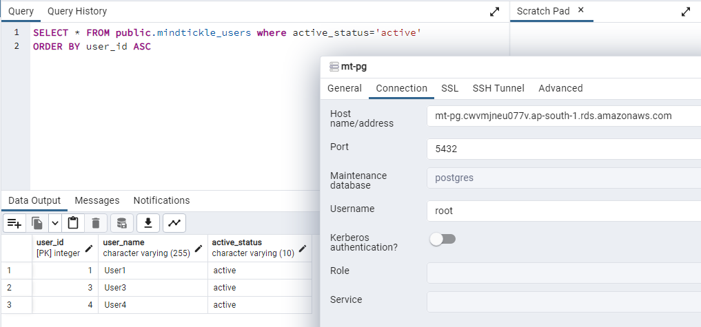
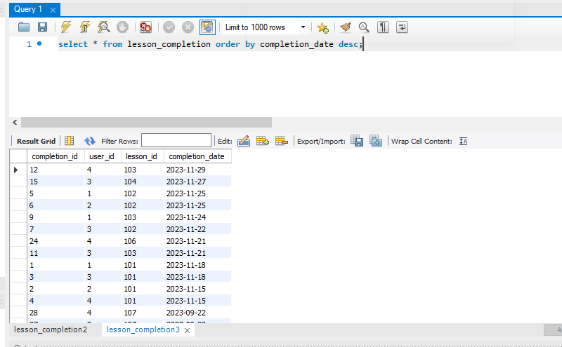
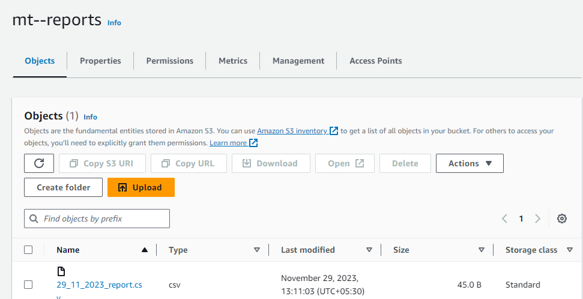
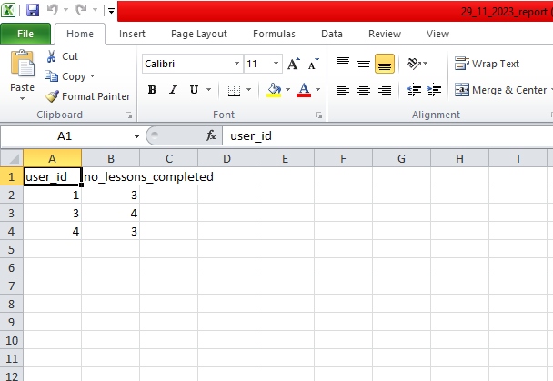
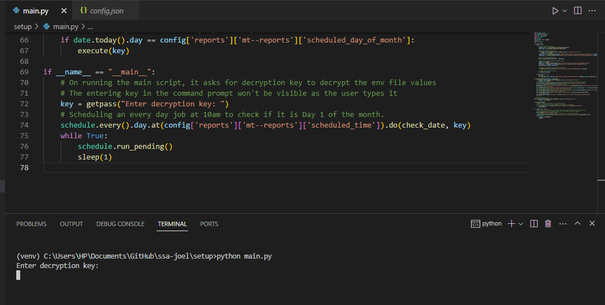

## Problem Statement
At Mindtickle, a client has requested a custom report that lists all active users on the platform and the number of daily lessons they have completed in the last 30 days. Your task is to create a Python script to generate this report and save it in an AWS S3 Bucket.

The data for this report is spread across two different databases: PostgreSQL and MySQL. You are not required to create the database, but you have access to the docker-compose file which will create the sample databases for you.

Criteria:
1. Understanding of the problem.
2. Correctness and efficiency of the solution
3. Clarity of the code written.

**Note:**
- Follow all the best practices you would follow for a production grade code.

### The solution has been implemented to run on Windows machines

- The solution uses AWS RDS (for Postgres & MySQL DBs), AWS S3 (for file upload) & AWS SES (for notifying system & application level errors & exceptions through emails).
- Dedicated modular & reusable functions to connect with end systems are implemented.
-  Exceptions are handled throughout the workflow & any application level errors & exceptions are notified to users through emails.
- All values in the environment file are encrypted using a generated key (used cryptography library Fernet).
- Dynamic properties like DB queries, S3 bucket details, scheduler date & time can be changed whenever neeed, are present under config.json
- Pylance linter has been used in VSCode IDE setup.
- Project dependencies are listed in requirements.txt.
- Logging

## Solution:

- Mindtickle active users list is pulled from Postgres DB 



- Lessons Completion records are pulled from MySQL DB

As per the image: Considering today (29/11/2023) as the Day 1 of the month, added some sample data that can fall under the filter of past 30 days



- Using Pandas filtering dataframe logics were applied over these data, the list of active users & their number of completed courses in the last 30 days are filtered.

- An AWS S3 bucket is configured to upload the data in csv format. The CSV report is prepared & upload to the S3 bucket.





## Steps to run the solution:
### Copy the valid encrypted values to the environment file
```
cd setup
copy .env.example .env
```
### The .env.example file has the actual valid encrypted credential values & the script will ask for the decryption key to start the scheduler which is not shared here.

### Create a virtual environment & activate it
```
python -m venv venv
cd venv/Scripts/
activate
```

### Pip install the dependencies
```
pip install -r requirements.txt
```
### Run the main.py file & enter the decryption key and so that scheduler starts
The scheduler considers the local windows machine time
```
python main.py
```
